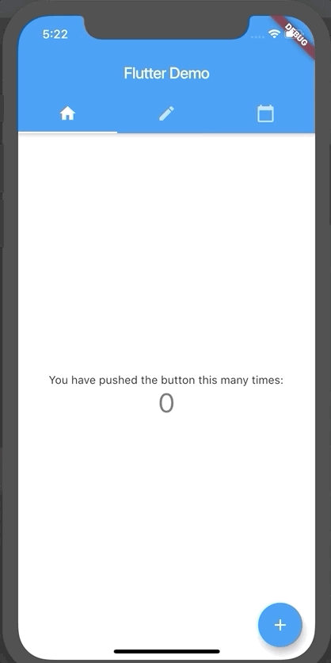

# 1. Navigation and routing - Tab-based navigation

## What we want to do?

To start with, we want to implement navigation with tab bar, and keep the original screen.

We will make use of the following widgets
- `DefaultTabController` - The parent widget containing `TabBar` and `TabBarView`
- `TabBar` - The widget displaying the tabs, with appearance of tabs defined by an array of `Tab`
- `TabBarView` - The widget displaying the contents of each tabs, with content defined by an array of `Widget`

## Reference
https://flutter.dev/docs/cookbook/design/tabs

## Getting Started

This project is a starting point for a Flutter application.

A few resources to get you started if this is your first Flutter project:

- [Lab: Write your first Flutter app](https://flutter.dev/docs/get-started/codelab)
- [Cookbook: Useful Flutter samples](https://flutter.dev/docs/cookbook)

For help getting started with Flutter, view our
[online documentation](https://flutter.dev/docs), which offers tutorials,
samples, guidance on mobile development, and a full API reference.
