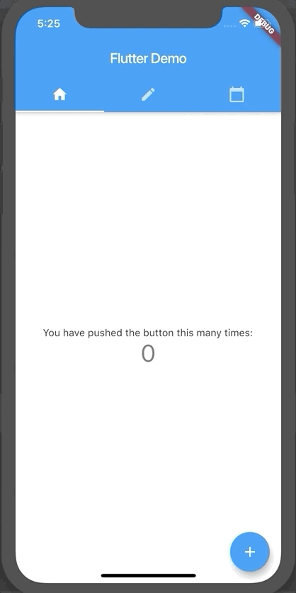

# 2. Adding interactivity - Handle user interaction

## What we want to do?

We want to have a text field. Users can type there, will see a snack bar when pressing return during typing.

## Reference

Text input
https://flutter.dev/docs/cookbook/forms/text-input

Easy layout responsiveness with `Expand`
https://api.flutter.dev/flutter/widgets/Expanded-class.html

Displaying a snackbar
https://flutter.dev/docs/cookbook/design/snackbars

## Getting Started

This project is a starting point for a Flutter application.

A few resources to get you started if this is your first Flutter project:

- [Lab: Write your first Flutter app](https://flutter.dev/docs/get-started/codelab)
- [Cookbook: Useful Flutter samples](https://flutter.dev/docs/cookbook)

For help getting started with Flutter, view our
[online documentation](https://flutter.dev/docs), which offers tutorials,
samples, guidance on mobile development, and a full API reference.
