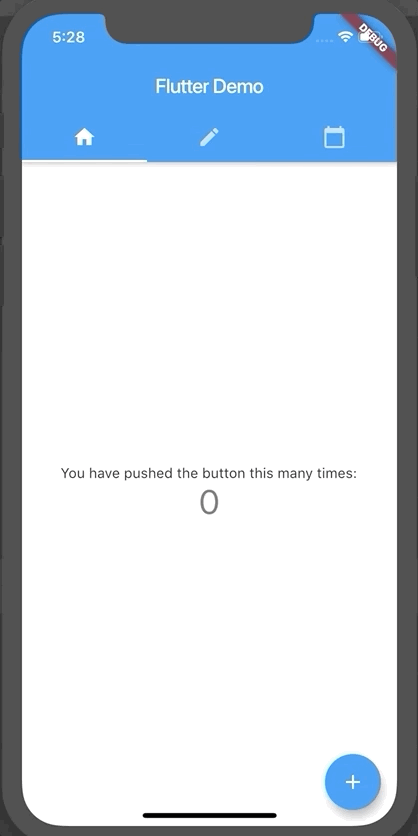

# 3. Handle state within the Widget - StatefulWidget

Instead of just showing an alert or snackbar, I want to persist what I have entered right now.
Let's save the messages you have entered. We do it by having a state as a list of strings, and displaying each strings as a row in `ListView`.

## Reference

Adding interactivity - https://flutter.dev/docs/development/ui/interactive
Stateful Widget - https://api.flutter.dev/flutter/widgets/StatefulWidget-class.html

## Getting Started

This project is a starting point for a Flutter application.

A few resources to get you started if this is your first Flutter project:

- [Lab: Write your first Flutter app](https://flutter.dev/docs/get-started/codelab)
- [Cookbook: Useful Flutter samples](https://flutter.dev/docs/cookbook)

For help getting started with Flutter, view our
[online documentation](https://flutter.dev/docs), which offers tutorials,
samples, guidance on mobile development, and a full API reference.
