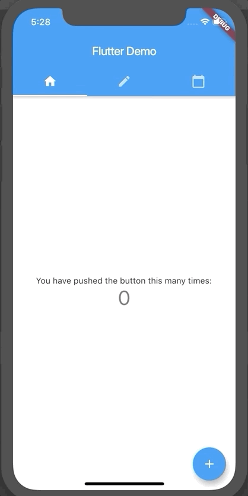

# 4. App State Management

If you have achived step 3 and played around, you may find that after switching away from and back to the message board scene, your previous messages are cleared. It is because upon tab switch, the state within the widget is lost by redenering.

Thus, we need to persist the state in an upper level, for example the root widget of the Flutter app, instead of just the scene widget.

Here are the widgets or classes we need to use.
- `ChangeNotifier` - Create a plain class as a data model. This class is similar to a POJO (or a PODO as "D" stand for Dart) but subclassing `ChangeNotifier`. After mutating any data in the model, notify the changes (i.e. re-render the UI by invoking `ChangeNotifier.notifyChanges()`).
- `ChangeNotifierProvider` - This is a `Widget`. Place it as part of the root widget, and return your own implementation of `ChangeNotifier` in the `builder` block argument with the constructor.
- `Consumer` - This is also a `Widget` with generic types. Wrap your own components with `Consumer<MyChangeNotifier>` to indicate its child is interested in the changes of this data model (i.e. you own `ChangeNotifier`).

## Note

After implementing this, we don't need a `StatefulWiget` anymore. `StatelessWidget` can already do the job because the re-rendering is handled by `Consumer`.

## Getting Started

This project is a starting point for a Flutter application.

A few resources to get you started if this is your first Flutter project:

- [Lab: Write your first Flutter app](https://flutter.dev/docs/get-started/codelab)
- [Cookbook: Useful Flutter samples](https://flutter.dev/docs/cookbook)

For help getting started with Flutter, view our
[online documentation](https://flutter.dev/docs), which offers tutorials,
samples, guidance on mobile development, and a full API reference.
